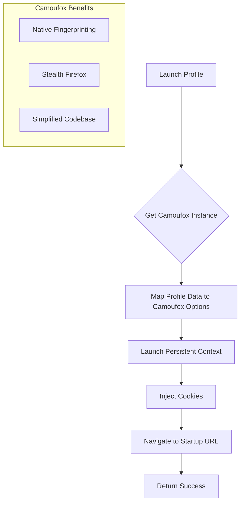

# Refactor Plan: Browser Engine (Patchright to Camoufox)

## Overview
Replace the `patchright` based browser engine with `camoufox`. Camoufox is a stealthy Firefox-based browser that handles fingerprinting and anti-bot evasion natively, which allows us to simplify our codebase by removing manual fingerprint injection scripts.

## Proposed Changes

### 1. Dependency Management (`pyproject.toml`)
- Remove `patchright`.
- Add `camoufox`.
- Keep `playwright` (as Camoufox depends on it/integrates with it).

### 2. Browser Engine Refactor (`src/services/_browser_engine.py`)
- **Imports**: Replace `patchright` imports with `camoufox.async_api.AsyncCamoufox`.
- **Launch Logic**: 
    - Use `AsyncCamoufox` context manager or equivalent `launch` method.
    - Map existing profile settings (UA, Proxy, Viewport, Geolocation, Timezone, Locale) to `AsyncCamoufox` parameters.
    - Remove manual `add_init_script` for fingerprinting as Camoufox handles this.
    - Update `launch_persistent_context` calls to Camoufox's equivalent.
- **Cleanup**: Update `close_all` and `_atexit_cleanup` to handle Camoufox instances.

### 3. Fingerprint Logic Removal
- Remove `src/services/_fingerprint_scripts.py`.
- Remove `src/services/_fingerprint_defaults.py` (if applicable and no longer needed).
- Update `src/services/_browser_engine.py` to no longer import `get_all_scripts`.

### 4. Integration Details
- **Proxy**: Camoufox accepts a `proxy` dict similar to Playwright.
- **Fingerprinting**: Camoufox has parameters like `os`, `geoip`, `fonts`, `webgl`, etc. We should map our profile data to these.
- **WebRTC**: Camoufox has `block_webrtc` parameter.

## Mermaid Workflow

## Next Steps
1. Approve this plan.
2. Switch to `code` mode.
3. Update `pyproject.toml`.
4. Implement changes in `src/services/_browser_engine.py`.
5. Remove obsolete files.
